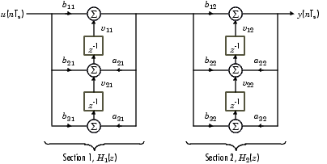

# Objective

The students should become familiar with various realization structures
for digital filters and implement them in the Simulink environment.

# Theoretical notions

The direct implementation forms are presented below:

## Direct Forms 

{width=50%}

{width=50%}

{width=50%}

{width=50%}

All the Direct Form images are from "Introduction to Digital Filters with Audio Applications", Julius O. Smith III, available here:
[https://www.dsprelated.com/freebooks/filters/](https://www.dsprelated.com/freebooks/filters/)

## Series form

In series form, the system function is decomposed as a product of smaller functions, typically of order 2:
$$H(z) = H_1(z) \cdot H_2(z) \cdot ... \cdot H_n(z)$$

The system is implemented from the smaller systems $H_1(z), H_2(z) ... H_n(z)$ arranged **in series**.
Each individual subsystem can be implemented as desired.

Example:

{width=75%}

Image is from "DSP blockset manual", Mathworks, available here:
[http://matrix.etseq.urv.es/manuals/matlab/toolbox/dspblks/biquadraticfilter.html](http://matrix.etseq.urv.es/manuals/matlab/toolbox/dspblks/biquadraticfilter.html)

## Parallel form

In parallel form, the system function is decomposed as a sum of smaller functions:
$$H(z) = H_1(z) + H_2(z) + ... + H_n(z)$$

The system is implemented from the smaller systems $H_1(z), H_2(z) ... H_n(z)$ arranged **in parallel**.

Example:

{width=50%}

Image is from "DIntroduction to DSP", BORES Signal Processing, available here:
[http://www.bores.com/courses/intro/iir/5_para.htm](http://www.bores.com/courses/intro/iir/5_para.htm)

# Exercises

1. For a general IIR filter of order 3, with system function
$$H(z) = \frac{b_0 + b_1 z^{-1} + b_2 z^{-2} + b_3 z^{-3}}{1 + a_1 z^{-1} + a_2 z^{-2} + a_3 z^{-3}},$$
draw the realization structure in the following forms:

    a. direct form I
    b. direct form II
    b. direct form I transposed
    c. direct form II transposed

2. For the digital filter with system function 
$$H(z) = \frac{2 (1 -z^{-1}) (1 + \sqrt(2) z^{-1} + z^{-2})}{(1 + 0.5 z^{-1}) (1 - 0.9 z^{-1} + 0.81 z^{-2}},$$
draw the realization structure in one of the series forms.

2. For the digital filter with system function
$$H(z) = \frac{5 - 6 z^{-1} + 3.72 z^{-2} - 0.74 z^{-3}}{1 - 1.5 z^{-1} + 1.24 z^{-2} - 0.37 z^{-3}} = 2 + \frac{1}{1-0.5 z^{-1}} + \frac{2 - z^{-1}}{1 - z^{-1} + 0.74 z^{-2}},$$
draw the realization structure in the parallel form.

1. In the Matlab environment, use the `fdatool` tool to design one of the following filters:
    
    a. A low-pass IIR filter of order 4, elliptic type, with cutoff frequency of 4kHz at a sampling frequency of 44.1kHz;
    a. A high-pass IIR filter of order 4, elliptic type, with cutoff frequency of 1kHz at a sampling frequency of 44.1kHz;
    a. A band-pass IIR filter of order 4, elliptic type, with passband between 700Hz and 4kHz at a sampling frequency of 44.1kHz.

1. In the Simulink environment, implement the above filters in direct form II. Apply at the input an audio signal and play the output signal, as well as the original, for comparison.
How does the filtered signal sound like, compared to the original?

1. In the Simulink environment, change one of the previous implementations to a series form (Second-Order-Sections).

# Notes:

- Set the following parameters for the SImulink model, to enable a discrete simulation with fixed (auto) step:
    - Type: *Fixed-step*
    - Solver: *discrete (no continuous states)*
    

- You will need the blocks *Unit Delay*, *Sum* and *Gain*
- At the input put a *From Multimedia File* block, and at the output put a *To Audio Device* block
- At the output, before the *To Audio Device* block, put a *Manual Switch* block in order to be able to switch easily
between the original signal and the filtered one
- For the *From Multimedia File* block, select an audio file (de ex. Kalimba.mp3 from My Documents)
and update the following settingsȘ
    - choose *Sample-based*
    - *Samples per audio channel* = 1 
    - "DataTypes/Audio output data type" = *double*

{width=50%}
{width=50%}

# Final questions

1. TBD
