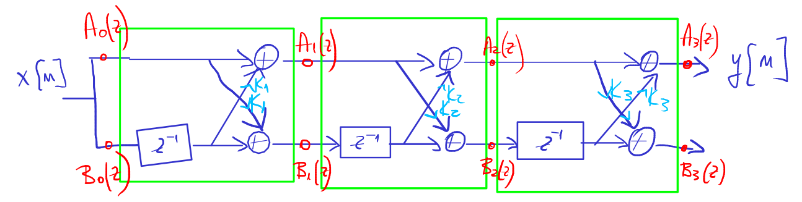

# Objective

The students should become familiar with *lattice*-type realization structure
used for implementing FIR filters.

# Theoretical notions

Lattice form for an FIR filter of order 3:

Equations:

$$\begin{aligned}
A_0(z) &= B_0(z) = 1 \\
A_m(z) &= A_{m-1}(z) + K_m \cdot z^{-1} \cdot B_{m-1}(z) \\
A_{m-1}(z) &= \frac{A_m(z) - K_m  \cdot B_m(z)}{1 - K_m^2} \\
B_m(z) &= z^{-m} B_m(z^{-1}) = \textrm{ like }A_m(z)\textrm{, with coefficients reversed}
\end{aligned}$$

These equations allow to convert $H(z)$ to the reflection coefficients needed by the lattice implementation,
or to find $H(z)$ from a given lattice implementation.

# Exercises

1. Find the FIR filter coefficients in direct form, if the reflection coefficients
of the lattice FIR structure are:
$K_1 = \frac{1}{2}$, $K_2 = 0.6$, $K_3 = -0,7$, $K_4 = \frac{1}{3}$.

2. Find the reflection coefficients of the lattice structure for a FIR filter with system function:
$$H(z) = 1 + \frac{2}{5}z^{-1} + \frac{7}{20}z^{-2} + \frac{1}{2}z^{-3}$$

1. In the Matlab environment, use the `fdatool` tool to design one of the following filters:
    
    a. A low-pass FIR filter of order 5, equiripple type, with cutoff frequency of 5kHz at a sampling frequency of 44.1kHz;
    a. A high-pass FIR filter of order 5, equiripple type, with cutoff frequency of 2kHz at a sampling frequency of 44.1kHz;
    a. A band-pass FIR filter of order 5, equiripple type, with passband between 1kHz and 3kHz at a sampling frequency of 44.1kHz.

1. In the Simulink environment, implement the above filters in *lattice* form. Apply at the input an audio signal and play the output signal, as well as the original, for comparison.
How does the filtered signal sound like, compared to the original?    

# Notes:

- Set the following parameters for the Simulink model, to enable a discrete simulation with fixed (auto) step:
    - Type: *Fixed-step*
    - Solver: *discrete (no continuous states)*
    

- You will need the blocks *Unit Delay*, *Sum* and *Gain*
- At the input put a *From Multimedia File* block, and at the output put a *To Audio Device* block
- At the output, before the *To Audio Device* block, put a *Manual Switch* block in order to be able to switch easily
between the original signal and the filtered one
- For the *From Multimedia File* block, select an audio file (de ex. Kalimba.mp3 from My Documents)
and update the following settingsȘ
    - choose *Sample-based*
    - *Samples per audio channel* = 1 
    - "DataTypes/Audio output data type" = *double*

{width=50%}
{width=50%}

# Final questions

1. TBD
