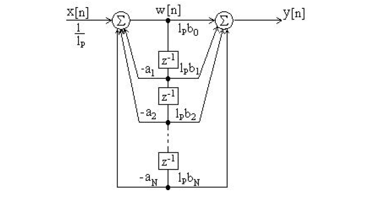

# Objective

Students should observe the effects of internal format overflow and underflow 
events on the output of a digital filter.

# Theoretical notions

# Exercises

1. Consider the following system:
	$$H(z) = \frac{1-\frac{1}{2}z^{-1}}{\left(1 - \frac{1}{4}z^{-1}\right)\left(1 + \frac{1}{4}z^{-1}\right)}$$

    a. Draw the direct form II implementation and one of the 
    series implementations
	b. Assume a fixed-point implementation with $b$ bits for the fractionary part.
	Each product is quantized by rounding to this format.
	Find the variance of the rounding noise due to the 
	internal multiplications, at the output of each implementation
	from a.

2. Consider the following system:
	$$H(z) = \frac{1-0.8z^{-1} -0.78z^{-3} + 0.1z^{-4}}{1 + 0.1z^{-1} - 0.08z^{-2}
    -0.264z^{-3} - 0.0504z^{-4}}$$

    a. Generate an input signal $x[n] = 0.9 u[n]$ and display it.
    b. Compute the output $y[n]$ of the system using the using Direct Form 2 implementation
    (use the function filter_df2() which we have created in a previous lab).
    c. Plot the output $y[n]$ as well the internal signal $w[n]$ (see the figure).
    
    

3. Display graphically the two summation characteristics $g1()$ and $g2()$ implemented in 
    the provided `.m` files. What do they mean with regard to summation?
    
4. Apply the two summation functions $g1()$ and $g2()$ to the two sums in the filter
   implementation, to simulate the effect of a finite-length summator. Plot the output $y[n]$ as well the internal signal $w[n]$ (see the figure). Do they look good or not?

5. Compute the three scaling norms $l_{\infty}$, $l_1$ and $l_2$ for overflow prevention,
    using the provided function `normescal()`. 
    Apply the scalings to the system, as depicted in the figure. Plot again the signals $w[n]$
    and $y[n]$. Is this better or worse than in the previous case?

# Final questions

1. TBD
